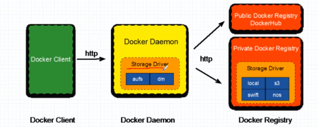
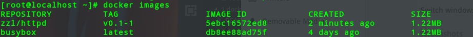

# 1 Images
## About Docker Images
```
Docker镜像含有启动容器所需的文件系统，因此，其用于创建并且启动docker容器
采用分层构建机制，最底层为bootfs,其之为rootfs
    bootfs:用于系统引导的文件系统,包括bootloader和kernel,容器启动完成后会被卸载以节约内存资源
    rootfs:位于bootfs之上,表现为docker容器的根文件系统;
        传统模式中,系统启动之时,内核挂载rootfs时会首先将其挂载为"只读"模式,完整性自检完成后将其重新挂载为读写模式
        docker中,rootfs由内核挂载为"只读"模式,而后通过"联合挂载"技术额外挂载一个"可写"层
```


## Docker Image Layer
```
    位于下层的镜像称为父镜像(parent image),最底层的称为基础镜像(base image)
    最上层为"可读"层,其下的均为"只读"层
```


# 2 FS
## Aufs
+ advanced multi-layered unification filesystem: 高级多层统一文件系统
+ 用于Linux 文件系统实现“联合挂载”
+ aufs 是之前的UnionFS的重新实现，2006年由Junjiro Okajima开发
+ aufs 的竞争产品是overlayfs,后者自从３.18版本开始被合并到Linux内核
+ docker的分层镜像，除了aufs，docker还支持btrfs,devicemapper和vfs等

>在Ubuntu系统下，docker默认aufs，而在Centos7上，用的是devicemapper；

## Devicemapper

# 3 Registry
## Docker Registry
+ 启动容器时，docker daemon 会试图从本地获取相关的镜像；本地镜像不存在时，其将从Registry中下载该镜像并且保存到本地


## Docker Registry分类
+ Registry 用于保存docker镜像，包括镜像的层次结构和元数据
+ 用户可自建Registry,也可以使用官方Docker Hub
+ 分类
    Sponsor
    Mirror
    Vendor
    Private

## Registry（repository and index）
```
由某特定的docker镜像的所有迭代版本组成的镜像仓库
一个Registry中可以存在多个Repository
  Repository可以分为“顶层仓库”和“用户仓库”
  用户仓库的格式为“用户名/仓库名”
每个仓库可以包含对个Tag,每个标签对应一个镜像

维护用户账户，镜像的校验以及公共命名空间的信息
相当于为Registry提供了一个完成用户认证等功能的检索接口
```

## Docker Hub
+ Docker Hub provides the following major features
    - Image Repositories
    - Automated Builds
    - WebHooks
    - Organizations
    - GitHub and Bitbucket Integration

## Getting images 
```
默认会从docker hub 下载
docker pull <registry>[:<port>]/[<namespace>/]<name>:<tag>
docker pull quay.io/coreos/flannel:v0.10.0-amd64
```

## 镜像相关的操作
+ 镜像的生成途径
    - 基于容器制作
    - 基于DockerFile
    - Docker Hub automated builds

```
docker commit [OPTIONS] CONTAINER [REPOSITORY[:TAG]]

eg:
    docker tag 5ebc16572ed8 zzl/httpd:v0.1-1

1.启动容器
    docker run --name zb1 -it busybox
2.制作镜像
    docker commit -a "zzl<853089986@qq.com>" -c 'CMD ["/bin/httpd","-f","-h","/data/html"]' -p zb1 zzl/httpd:v0.2
3.将镜像放到远程
    docker login
    docker push
```



## 镜像的导入和导出
```
docker save
    Save one or more images to tar archive
    Usage: docker  save [options] image[image...]
        --output,-o:write to a file,instead of STDOUT

docker load 
    Load an image from a tar archive or STDIN
    Usage: docker load [OPTIONS]
        --input,-i:Read from tar archive file,instead of STDIN
        --quite,-q:Suppress the load output
```