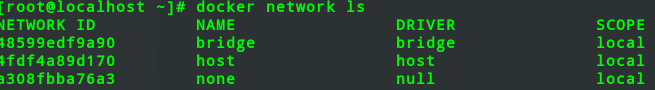
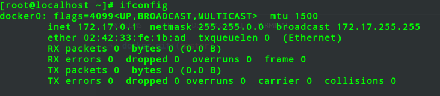
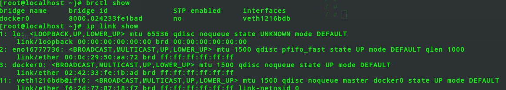

# docker网络

## 


## docker0 交换机

```
 yum install -y bridge-utils
```


## 控制隔离


## 指定网络

查看docker 网络
> docker run --network
查看端口映射
> iptables -t nat -vnL
## Bridged containers
+ 可以为docker run 命令使用
    + "--hostname HOSTNAME"选项为容器指定主机名，列如
    ```
    docker run --rm --net bridge --hostname llinux.io busybox:latest nslookup llinux.io
    ```
    + "--dns DNS_SERVER_IP"选项能够为容器指定所使用的dns服务器地址，列如
    ```
    docker run --rm --dns 10.10.1.1 busybox:latest 
    nslookup llinux.io
    ```
    + "--add-host HOSTNAME:IP"选项能够为容器指定本地主机名解析项，列如
    ```
    docker run --rm --dns 10.10.1.1 --add-host "docker.com:172.16.0.100" busybox:latest 
    nslookup docker.com
    ```
    
## Opening inbound communication

docker port <NAME>
```
-p 选项的使用格式

    -p <containnerPort>
    随机分配宿主机端口

    -p <hostPort>:<containnerPort>
    会关联0.0.0.0
    docker run --rm -p 80:80 --name b1  e1527130cc66

    -p <ip>::<containnerPort>
    随机分配宿主机端口
    docker run --rm -p 10.6.20.181::80 --name b1  e1527130cc66

    -p <ip>:<hostPort>:<containnerPort>
    docker run --rm -p 10.6.20.181:80:80 --name b1  e1527130cc66

    -P 暴露所以端口
```

## Joined containers
```
联盟式容器是指使用某个已存在容器的网络接口，接口被联盟内的各个容器共享使用；
因此，联盟式容器彼此间完全无隔离，列如

1.创建一个监听于2222端口的http服务容器
    docker run -d -it --rm -p 2222 busybox /bin/httpd -p 2222 -f
2.创建一个联盟式容器，并且查看 其监听的端口
    docker run -d -it --rm --net container:web --name joined busybox netstat -ran

 联盟式容器式彼此间虽然共享同一个网络名称空间，但其它名称空间如User,Mount等还是隔离的

 联盟式容器彼此间存在端口冲突的可能性，因此，通常只会在多个容器上的程序需要程序loopback接口相互通信，或对某已存的容器网络属性进行监控才使用此模式网络模型   
```